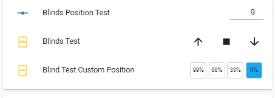
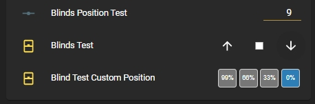
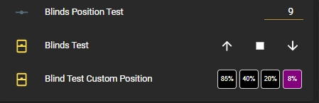
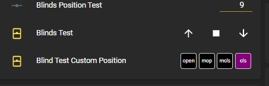

# cover-position-preset-row
Provides a means to program 3 preset position settings for programmable cover entities selectable from a Lovelace button row. This plugin will also accept a "cover group" as the entity_id.

This pluig-in was inspired by user @ktownsend-personal on the Home Assistant forum (community.home-assistant.io) as a thematically complementary plug-in for my other various control rows.

This element is completely theme-able to provide a match to the other control rows to provide a consistent look for the different elements in your Lovelace frontend

Installation:

The easiest way to install this is to use the Home Assistant Community Store (HACS) in Home Assistant.

Follow the instructions there for installation making sure you note the "url:" section for the resources addition.


Conversely, if you don't use HACS you can install it manually by performing the following:

Copy the cover-position-preset-row.js file to the appropriate folder in your Home Assistant Configuration directory (/config/www/).

Place the following in your "resources" section in your lovelace configuration (updating the localation to where you placed the above file):

  ```
    - url: /local/cover-position-preset-row.js
      type: module
  ```
    
Then to use this in a card place the following in your entity card:


<b>Options:</b>

| Name | Type | Required | Default | Description |
| --- | --- | --- | --- | --- |
| entity | String | Yes | none | Any positional cover entity_id (including "cover group" entities) |
| type | String | Yes | none | custom:cover-position-entity-row |
| name | String | No | none | A custom name for the entity in the row |
| customTheme | Boolean | No | false | set to true to use a custom theme |
| customSetpoints | Boolean | No | false | set to true to use custom brightness setpoints |
| IsOpenedColor | String | No | '#f44c09' | Sets the color of the 'Open' button if cover is fully open |
| IsMidOpenedColor | String | No | '#f44c09' | Sets the color of the 'mid open' button if cover is partially open but closer to open |
| IsMidClosedColor | String | No | '#f44c09' | Sets the color of the 'mid closed' button if cover is partially open but cloder to closed |
| IsClosedColor | String | No | '#43A047' | Sets the color of the 'closed' button if cover is closed |
| ButtonInactiveColor | String | No | '#759aaa' | Sets the color of the the buttons if that selection is not "active" |
| OpenPosition | Integer | No | 99 | Sets the position setpoint for the "open" button (max 100) |
| MidOpenPosition | Integer | No | 66 | Sets the position setpoint for the "mid open" button  |
| MidClosedPosition | Integer | No | 33 | Sets the position setpoint for the "mid close" button |
| ClosedPosition | Integer | No | 0 | Sets the position setpoint for the "close" button (min 0)|
| customOpenText | String | No | '99%' | Sets the text of the "open" position button |
| customMidOpenText | String | No | '66%' | Sets the text of the "mid open" position button |
| customMidClosedText | String | No | '33%' | Sets the text of the "mid close" position button |
| customClosedText | String | No | '0%' | Sets the text of the "close" position button |


The values for the colors can be any valid color string in "HEX", "RGB" or by color name.

If the cover position is changed via any other means (slider, service call, etc) the buttons will indicate which range the cover position is in based on the setpoint settings in the config.

This plugin can also be used with a group of positionable covers by creating a "cover group". Then each cover in the group will be simultaneously controlled by the plugin.

<b>Configuration Examples:</b>
    
  ```
    cards:
      - type: entities
        title: cover theme test
        show_header_toggle: false
        state_color: true
        entities:
          - type: custom:cover-position-preset-row
            name: Blind Custom Position
            entity: cover.blinds_test
            ## used to select your own customizable theme
            customTheme: true
            IsOpenColor: 'rgb(255, 0, 0)'
            IsMidOpenColor: '#888888'
            IsMidClosedColor: '#222222'
            IsClosedColor: 'purple'
            ButtonInactiveColor: 'black'
            ## used to set the custom setpoints for the cover (default is 0, 33, 66, and 99)
            customSetpoints: true
            OpenPosition: 85
            MidOpenPosition: 40
            MidClosePosition: 20
            ClosePosition: 8
            ## used to select custom text for the buttons (defaults to 0, 33, 66, 99. Or it defaults to the values of the setpoints if custom setpoints are used)
            customText: true
            customOpenText: open
            customMidOpenText: mop
            customMidClosedText: mcls
            customClosedText: cls
  ```

This is with the default Lovelace frontend theme set:




This is with the "Slate" frontend theme set:



This is with custom setpoints and a custom theme:



And here is the above with custom text:


